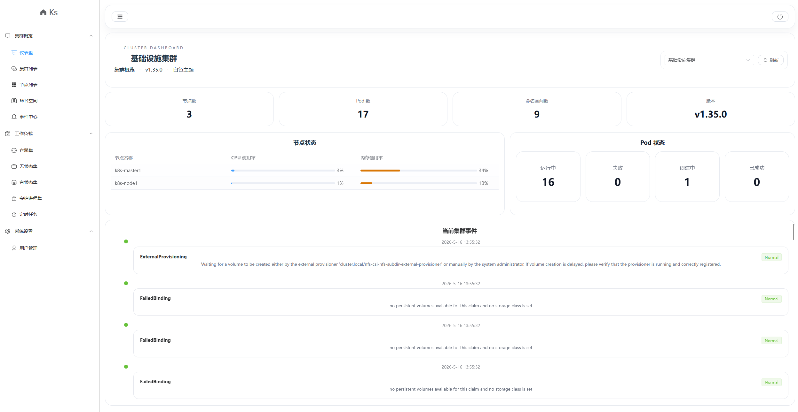

### 目录结构：

web     前端代码
web/README.md   前端部署文档

server  后端代码
server/README.md   后端部署文档

chart   ks项目chart包文件

### 兼容性

kubernetes 1.23
kubernetes 1.35


### Helm 部署

```bash
# 拉取代码
git clone https://github.com/yh-lib/Ks.git
# 根据需求  编辑 values.yaml
vim chart/values.yaml
# 安装 release
helm install ks -n ks .
```

```bash
# values.yaml 部分参数说明

# ks 控制台登录用户名密码
- name: USERNAME
  value: Admin
- name: PASSWORD
  value: Admin123

# 配置存放集群元数据的namespace
- name: METADATA_NAMESPACE
  value: ks

# client-go 是否通过 in-cluster 方式初始化
# 集群内部署   还是集群外部署
- name: INCLUSTER
  value: "true"
```


### 依赖关系

1. 前端服务依赖后端服务（否则无法正常登录验证）
2. 后端服务依赖k8s集群状态（否则无法获取METADATA_NAMSPACE中集群的kubeconfig，后端服务将无法启动）

### 效果图：

