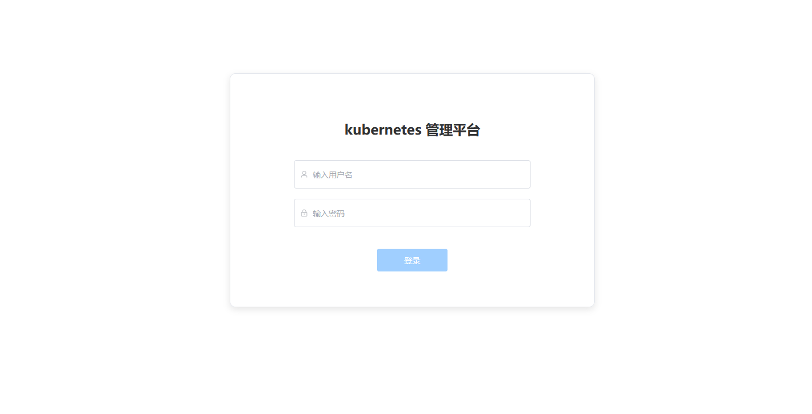

## 传统部署

1. 拉取代码

```bash
git clone https://github.com/yh-lib/Ks.git
```

2. 编译

```bash
# 进入前端目录
cmd
cd web
npm run build
```

2. 部署代码

```bash
cp -rp dist /usr/share/nginx/html
```

3. 修改 nginx.conf 配置

```bash
vim nginx.conf
```

4. 启动服务

```bash
systemctl restart nginx
```

# 容器化部署

1. 编辑 dockerfile

```bash
# 根据需求编辑dockerfile
vim ./dockerfile
```

2. 制作镜像

```bash
docker build -t crpi-o5e9g8vha41iltg8.cn-hangzhou.personal.cr.aliyuncs.com/ks_img/ks-web:v1.0 .
```

3. 推送镜像至仓库

```bash
docker push crpi-o5e9g8vha41iltg8.cn-hangzhou.personal.cr.aliyuncs.com/ks_img/ks-web:v1.0
```

4. 启动服务

```bash
docker run \
--name ks-web \
-p  "10002:80" \   # 端口映射
crpi-o5e9g8vha41iltg8.cn-hangzhou.personal.cr.aliyuncs.com/ks_img/ks-web:v1.0  # 构建的镜像
```

5. 测试
   打开浏览器访问：http://127.0.0.1:10002/#/login
   通过后端环境变量中配置的用户名 Admin 密码 Admin123，进行登录
   
